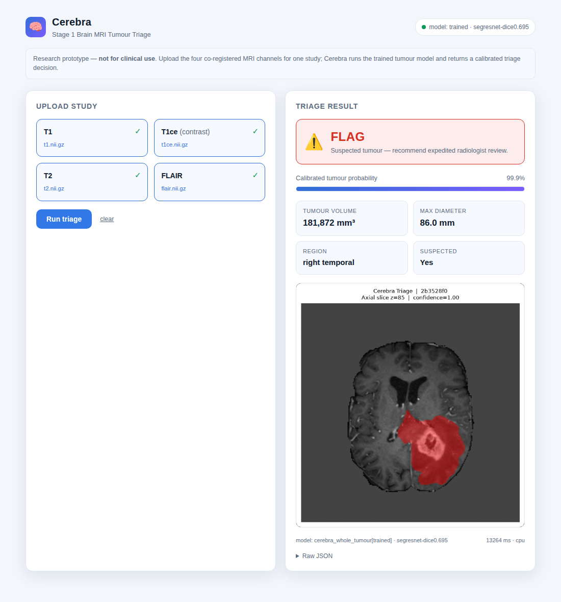

# Cerebra — Stage 1 Brain MRI Triage POC

An AI brain-MRI triage system that flags suspected intracranial tumours from multimodal MRI within minutes, with a **temperature-calibrated** tumour probability and a structured JSON output.

Cerebra trains **its own** binary whole-tumour segmentation model on the **publicly accessible** Medical Segmentation Decathlon **Task01_BrainTumour** dataset (484 expert-annotated multimodal studies — the same imaging cohort as BraTS, but openly hosted with no registration). The trained model's probabilities are then **calibrated by temperature scaling** so the reported "probability of tumour" is trustworthy, not just a monotonic score.

> **This is a POC, not a product.** It is not validated for clinical use and must not be used for patient diagnosis or triage decisions.

---

## What it does

1. Accepts a brain MRI study (4 NIfTI files: T1, T1ce, T2, FLAIR) or a DICOM directory
2. Preprocesses: reorder to canonical channels → resample to 1 mm³ isotropic → z-score normalise
3. Runs sliding-window inference with the **trained Cerebra whole-tumour model** (SegResNet by default, Swin UNETR optional)
4. Converts logits to a **calibrated** P(tumour) map via temperature scaling
5. Computes: tumour volume, max axial diameter, coarse anatomical region, study-level probability
6. Applies triage rule: **FLAG** if volume ≥ 250 mm³ **and** probability ≥ 0.5
7. Saves a 2D axial PNG overlay and returns a structured JSON report

### Model resolution order

At inference the best available model is used automatically:

1. **Trained Cerebra checkpoint** — `models/cerebra_whole_tumour.pt` (our own model, calibrated)
2. **MONAI bundle** — pretrained `brats_mri_segmentation` (4-class BraTS), if downloaded
3. **Untrained fallback** — random-weight SegResNet, **smoke-test only**, logged loudly

### Output schema

```json
{
  "study_id": "demo01",
  "triage_decision": "FLAG",
  "confidence": 0.87,
  "findings": {
    "tumour_suspected": true,
    "tumour_volume_mm3": 12345.6,
    "anatomical_region": "right frontal",
    "max_diameter_mm": 24.3
  },
  "model_metadata": {
    "model_id": "cerebra_whole_tumour[trained]",
    "model_version": "segresnet-dice0.812",
    "inference_time_ms": 4321,
    "device": "cpu"
  },
  "visualization_path": "/tmp/cerebra_demo01_overlay.png",
  "schema_version": "0.1.0"
}
```

`confidence` is the calibrated study-level tumour probability (mean of the most-confident decile of voxels in the flagged region).

---

## Real data + training

### 1. Download the public dataset (~7.6 GB, no registration)

```bash
python scripts/download_data.py            # → data/Task01_BrainTumour/
```

The dataset is the **MSD Task01_BrainTumour** cohort, openly mirrored on S3. It ships 484 studies, each with 4 co-registered MRI channels and an expert tumour annotation. Cerebra reframes the labels as **binary whole-tumour** (any tumour vs. background) — exactly the Stage-1 triage question, and far faster to train reliably than the 3-class problem.

### 2. Train + calibrate (GPU)

The training pipeline auto-detects CUDA and uses mixed precision when a GPU is present. The **recommended full run** on a local GPU:

```bash
# Clinical-grade target: full 484-study dataset, Swin UNETR, 300 epochs
python scripts/train_model.py --architecture swinunetr --roi 128 128 128 --max-epochs 300

# Lighter/faster GPU baseline: SegResNet on the full dataset
python scripts/train_model.py --architecture segresnet --roi 128 128 128 --max-epochs 150
```

Training uses DiceCE loss, AdamW + cosine LR, AMP (CUDA), patch-based sampling, sliding-window validation with a real Dice metric, and best-Dice checkpointing. After the best checkpoint is chosen, **temperature scaling** is fit on the validation set and written back into the checkpoint (`temperature`, `ece_before`, `ece_after`).

Expect a full GPU run to reach whole-tumour Dice in the **~0.85–0.90** range (the standard BraTS whole-tumour ceiling). A single 16 GB GPU handles `--roi 128 128 128` at `batch_size 1`; drop to `--roi 96 96 96` if you hit out-of-memory.

### 3. Evaluate the trained model

```bash
python scripts/evaluate.py --limit-studies 0 --csv eval_percase.csv
```

Reports mean/per-case whole-tumour Dice **using the same calibrated 0.5 threshold the triage pipeline applies**, Expected Calibration Error before/after temperature, and the FLAG/CLEAR triage confusion counts. Writing the per-case CSV lets you spot failure cases.

> **CPU fallback (this repo's shipped checkpoint).** Everything above also runs on CPU, just far slower. The checkpoint committed here, `models/cerebra_whole_tumour.pt`, came from a **bounded CPU run** (SegResNet, 48 train / 12 val studies, ROI 96³) used to prove the pipeline end-to-end. For a real deployment, retrain locally on GPU with the commands above — your run overwrites this checkpoint.
>
> | Metric (shipped CPU checkpoint) | Value |
> |---|---|
> | Best validation whole-tumour Dice | 0.70 |
> | Fitted temperature | 0.334 |
> | Expected Calibration Error | 0.218 → 0.057 after temperature scaling |
> | Per-case Dice on a held-out real study | 0.61 (correctly FLAGged) |

For a quick CPU sanity run (no GPU, minutes):

```bash
python scripts/train_model.py --limit-studies 24 --max-epochs 8 --max-train-steps 20 --roi 96 96 96
```

---

## Install

### Prerequisites

- Python 3.11+
- [uv](https://docs.astral.sh/uv/) (`curl -LsSf https://astral.sh/uv/install.sh | sh`)

### Setup

```bash
git clone https://github.com/mohammedkarimkhaldi/cerebra.git
cd cerebra

uv venv --python 3.11

# GPU (recommended for local runs): default PyPI PyTorch wheels are CUDA-enabled
uv pip install -e "."

# — or — CPU-only host: use the CPU wheel index
# uv pip install -e "." --extra-index-url https://download.pytorch.org/whl/cpu

# Dev dependencies (tests)
uv pip install pytest pytest-cov pytest-asyncio
```

Verify the GPU is visible: `python -c "import torch; print(torch.cuda.is_available())"` should print `True`.

---

## Running on a study directory

Point the CLI at any directory containing the four MRI channels (case-insensitive suffix matching):
- `*_t1.nii.gz`
- `*_t1ce.nii.gz` or `*_t1c.nii.gz`
- `*_t2.nii.gz`
- `*_flair.nii.gz`

```bash
cerebra-triage /path/to/study_dir --output-dir /tmp/cerebra_out
```

Studies from the downloaded MSD dataset live under `data/Task01_BrainTumour/imagesTr/` as single 4-channel NIfTI files; the demo and tests use a synthetic fixture so you can run everything without the full download.

### Optional: pretrained MONAI bundle

If you have not trained a Cerebra model, the pipeline can fall back to the pretrained 4-class `brats_mri_segmentation` bundle:

```bash
python -m monai.bundle download --name brats_mri_segmentation --bundle_dir ./models
```

If neither a trained checkpoint nor the bundle is available, an **untrained** SegResNet is used for structural smoke tests only — outputs are not meaningful and this is logged loudly at WARNING level.

---

## Quick demo (synthetic data)

```bash
# Generate synthetic fixture and run the full pipeline
python scripts/run_demo.py --output-dir /tmp/cerebra_demo
```

Expected output: a JSON report printed to stdout and a PNG overlay saved to `/tmp/cerebra_demo/`, completing in under 60 s on CPU.

---

## CLI

```bash
# Triage a study — prints JSON to stdout, writes PNG to /tmp
cerebra-triage /path/to/study_dir

# Custom output directory
cerebra-triage /path/to/study_dir --output-dir /tmp/my_output

# With a stable study identifier
cerebra-triage /path/to/study_dir --study-id patient_001
```

---

## Web UI (easiest way to use it)

Start the server and open the page in a browser — no command line needed after that:

```bash
uvicorn cerebra.api:app --host 0.0.0.0 --port 8000
# then open http://localhost:8000
```

Drop the four MRI channels (T1, T1ce, T2, FLAIR) into their slots and click **Run triage**. You get the FLAG/CLEAR decision, the calibrated tumour probability, volume / diameter / region, and the segmentation overlay — all in the page.



The header shows which model is loaded (`trained`, `bundle`, or `fallback`).

## HTTP API

The UI is backed by a small REST API you can also call directly:

| Method | Route | Body | Returns |
|---|---|---|---|
| `GET` | `/` | – | the web UI |
| `POST` | `/triage/files` | 4 files: `t1`, `t1ce`, `t2`, `flair` | `TriageReport` JSON |
| `POST` | `/triage` | one `file` = zip/tar.gz of a study dir | `TriageReport` JSON |
| `GET` | `/overlay/{study_id}` | – | overlay PNG |
| `GET` | `/health` | – | model status |

```bash
# four loose NIfTI channels
curl -F t1=@t1.nii.gz -F t1ce=@t1ce.nii.gz -F t2=@t2.nii.gz -F flair=@flair.nii.gz \
     http://localhost:8000/triage/files

# or a zipped study directory
cd /path/to/study_dir && zip -r /tmp/study.zip . && curl -F file=@/tmp/study.zip \
     http://localhost:8000/triage
```

Interactive OpenAPI docs: http://localhost:8000/docs

---

## Run tests

```bash
pytest tests/ -v --cov=src/cerebra
```

The 44 tests use a synthetic fixture and do **not** require the dataset download.
If a trained checkpoint is present the end-to-end tests exercise it; otherwise they
fall back to the untrained model. Coverage on the pure-logic modules:

| Module | Coverage |
|---|---|
| `schemas.py` | 100% |
| `postprocess.py` | 97% |
| `model.py` | 90% |
| `calibrate.py` | core math (temperature fit, ECE) unit-tested |

---

## Docker

**GPU image** (`docker/Dockerfile.gpu`, CUDA base — for local training + fast inference; needs the NVIDIA Container Toolkit):

```bash
docker build -f docker/Dockerfile.gpu -t cerebra:gpu .

# Train on the GPU (mount data + models so the checkpoint persists)
docker run --gpus all -v $PWD/data:/app/data -v $PWD/models:/app/models \
    cerebra:gpu python scripts/train_model.py --architecture swinunetr --max-epochs 300

# Serve the API on the GPU
docker run --gpus all -v $PWD/models:/app/models -p 8000:8000 cerebra:gpu
```

**CPU image** (`docker/Dockerfile`, for inference/demo only):

```bash
docker build -f docker/Dockerfile -t cerebra:latest .
docker run -p 8000:8000 cerebra:latest
docker run --rm cerebra:latest python scripts/run_demo.py
```

---

## Project layout

```
cerebra/
├── pyproject.toml
├── README.md
├── .gitignore
├── src/cerebra/
│   ├── __init__.py
│   ├── schemas.py         # Pydantic models for the triage report
│   ├── data.py            # real MSD dataset ingestion + transforms (binary whole-tumour)
│   ├── model.py           # model factory: SegResNet (default) / Swin UNETR
│   ├── train.py           # modern training pipeline (DiceCE, cosine LR, best-Dice ckpt)
│   ├── calibrate.py       # temperature scaling for reliable probabilities
│   ├── preprocess.py      # DICOM/NIfTI loading + MONAI transforms
│   ├── inference.py       # trained-ckpt / bundle / fallback resolution + calibrated infer
│   ├── postprocess.py     # threshold, volume, region mapping, study probability
│   ├── viz.py             # axial-slice overlay rendering with matplotlib
│   ├── pipeline.py        # orchestrates preprocess → infer → postprocess → report
│   ├── cli.py             # cerebra-triage entry point (Typer)
│   ├── api.py             # FastAPI app: web UI + triage endpoints
│   └── static/
│       └── index.html     # single-page web UI (served at /)
├── tests/
│   ├── conftest.py        # builds synthetic fixture
│   ├── test_postprocess.py
│   ├── test_model_calibrate.py
│   ├── test_pipeline.py
│   └── test_api.py
├── scripts/
│   ├── make_synthetic_sample.py
│   ├── download_data.py   # fetch + extract public MSD Task01_BrainTumour
│   ├── train_model.py     # train + calibrate on real data
│   ├── evaluate.py        # Dice + calibration + triage confusion on held-out data
│   └── run_demo.py        # end-to-end demo against synthetic sample
└── docker/
    ├── Dockerfile         # CPU image (inference/demo)
    └── Dockerfile.gpu     # CUDA image (local training + fast inference)
```

---

## Known limitations / production TODOs

- **Compute** — the checkpoint shipped from a CPU run is a real, calibrated model that learns tumour features but is not converged to clinical Dice. Retrain on GPU (`scripts/train_model.py --architecture swinunetr --max-epochs 300`) for clinical-grade performance.
- **Anatomical region mapping** uses a bounding-box heuristic on volume centre. Production would register to MNI152 and use an atlas (AAL or Brodmann areas).
- **DICOM modality identification** maps series alphabetically. Production should parse `SeriesDescription` or `ProtocolName` DICOM tags.
- **No authentication** — the API is open. Production requires AuthN/AuthZ.
- **Outputs written to /tmp** — not persistent. Production would use object storage.
- **CPU-only Docker image** — add `nvidia/cuda` base for GPU-accelerated training/inference.

---

## Disclaimer

This software is a research prototype only. It has not been validated for clinical use, is not a medical device, and must not be used to make patient care decisions.